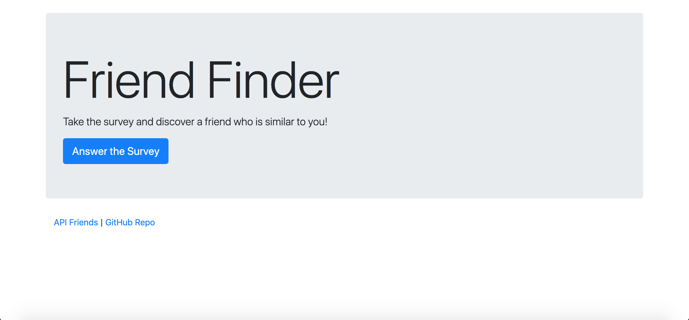
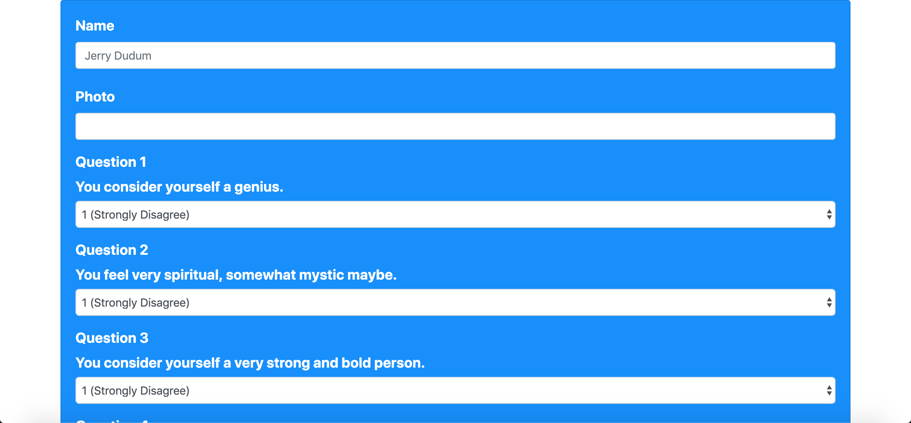
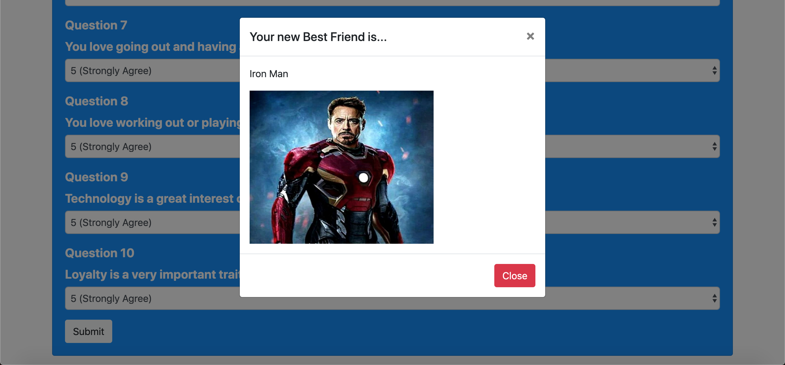

# Friend-Finder

Welcome to Friend Finder! This website has the user take a custom survey to figure out your best friend match, specifically a friend from the Avengers. Once a user has completed the survey they are actually added to the list of friends becoming a potential match for another user. On the bottom of the homepage there is a link to an API showing all results possible for the survey. Also there is a link that goes directly to my github and on the survey page there is a home link at the bottom so you can go back and see your own data in the array.

# Homepage

# Survey

# Result

# Link to Github Page
[Friend Finder](https://github.com/Jerry-Dudum/Friend-Finder)

# Link to Deployed Site (Heroku)
[Site](https://polar-hamlet-55844.herokuapp.com/)

# Technologies Used
- HTML
- Javascript
- jQuery
- Node
- npm

# NPM's Used
- Express
- Path

